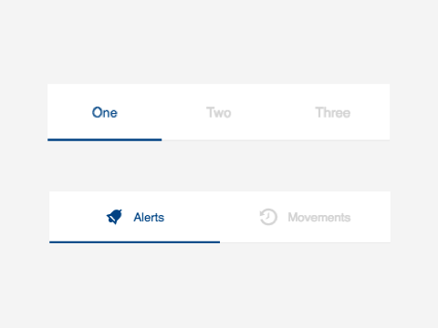

# cells-radio-tabs

[](http://bbva-files.s3.amazonaws.com/cells/bbva-catalog/index.html)

[Demo of component in Cells Catalog](http://bbva-files.s3.amazonaws.com/cells/bbva-catalog/index.html#/elements/cells-radio-tabs)

`<cells-radio-tabs>` displays a list of tabs from its `options` property.
The `options` property can be an array of strings or an array of objects with an optional `icon` property and a `label` property that will be used as the tab text.

Example with simple options:

```html
<cells-radio-tabs options='["Home", "Accounts"]'></cells-radio-tabs>
```

Example with text and icons:

```html
<cells-radio-tabs options='[{
  "icon": "coronita:home",
  "label": "Home"
}, {
  "icon": "coronita:alarm",
  "label": "Alerts"
}]'></cells-radio-tabs>
```

## Icons

Since this component uses icons, it will need an [iconset](https://bbva.cellsjs.com/guides/best-practices/cells-icons.html) in your project as an [application level dependency](https://bbva.cellsjs.com/guides/advanced-guides/application-level-dependencies.html). In fact, this component uses an iconset in its demo.

## Styling

The following custom properties and mixins are available for styling:

Custom property | Description | Default
:--- | :--- | :---
--cells-radio-tabs | Mixin applied to :host | {}
--cells-radio-tabs-bg-color | background-color applied to host | var(--bbva-white, #fff)
--cells-radio-tabs-border-bottom-color | border-bottom color for each tab | var(--bbva-200, #E9E9E9)
--cells-radio-tabs-border-radius | border-radius applied to host | 0
--cells-radio-tabs-color | Text color | var(--bbva-300, #D3D3D3)
--cells-radio-tabs-color-selected | Text color for selected tab | var(--bbva-core-blue, #004481)
--cells-radio-tabs-content | Empty mixin for tab content (icon + text) | {}
--cells-radio-tabs-icon | Empty mixin for the icon | {}
--cells-radio-tabs-icon-margin | Margin applied to icon | 0 0.625rem 0 0 (0 10px 0 0)
--cells-radio-tabs-indicator-bg-color | background-color for the current tab indicator | var(--bbva-core-blue, #004481)
--cells-radio-tabs-item-height | Tab height | 3.4375rem (55px)
--cells-radio-tabs-option | Empty mixin for each tab | {}
--cells-radio-tabs-selected | Empty mixin for selected tab | {}
