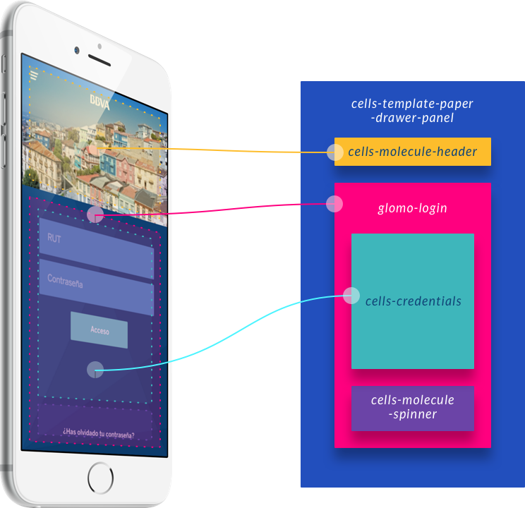

## Overview

Cells is an architecture built over the idea that instead of building applications **is better to build a set of reusable components** (business modules) that are assembled and communicated to create applications.

Cells was designed to enhance reusability of components and dynamism of applications.

Here you are a short video about how Cells works to have in mind the architecture's concept.

### Introducing Cells

A Cells application is a set of pages where each page is defined as a **layout** and a **list of components**. 

In that list, for each component there is a definition of its **properties**, its **communications** with other components **and the layout zone** where the component will be injected.

You can configure complex applications according to different parameters such as device, user profile, environmental properties (such as backend workload) among others.

### Cells ecosystem

There are several items that you need to know in the cells ecosystem.

1. **Bridge**: Cells Polymer Bridge is **"the cells engine"** that read every page's configuration in real time and create each html page.

2. **Catalog**: Cells have the [Cells Components Catalog](https://bbva-files.s3.amazonaws.com/cells/bbva-catalog/index.html) with a lot of Production Ready components that you can use in your application.

3. **CLI**: The Cells CLI is a development environment to help you out build applications and components faster.

4. **Composer**: (Coming soon)

5. **Documentation**: You can find a wide documentation in BBVA Ether Platform, in [Developer's area](https://bbva-devplatform.appspot.com/en-us/developers/engines/cells/documentation/quick-start/introducing-cells)

6. **Continuous Integration**: Ether includes Continuous Integration in the development lifecycle that includes a set of tools to make simple the deploy's process. You can manage your proyects from [Dev Tools Application](https://globaldevtools.bbva.com/beapp/static/#!/home) where we can create products, applications and components.

 
